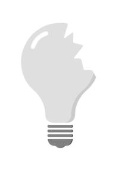

# Projeto de Lâmpada com Funcionalidades de Liga/Desliga e Quebra⚡️

Este é um projeto simples de uma lâmpada virtual que pode ser ligada, desligada e quebrada usando JavaScript, HTML e CSS.

## Funcionalidades ▶️

- **Ligar a Lâmpada**: Ao clicar no botão "Ligar", a lâmpada se acenderá.

- **Desligar a Lâmpada**: Ao clicar no botão "Desligar", a lâmpada se apagará.

- **Quebrar a Lâmpada**: Ao clicar na própria lâmpada, ela quebrará.

## Como Usar 🔎

1. Clone ou faça o download deste repositório para o seu computador.

2. Abra o arquivo `index.html` em seu navegador da web.

3. Clique no botão "Ligar" para acender a lâmpada, no botão "Desligar" para apagá-la ou clique diretamente na lâmpada para quebrá-la.

## Contribuindo 👊🏼 

Se você quiser contribuir para este projeto, fique à vontade para abrir uma issue ou enviar uma solicitação de pull request.
 
Espero que você ache este projeto divertido de usar!!! Se tiver alguma pergunta ou sugestão, não hesite em entrar em contato.
